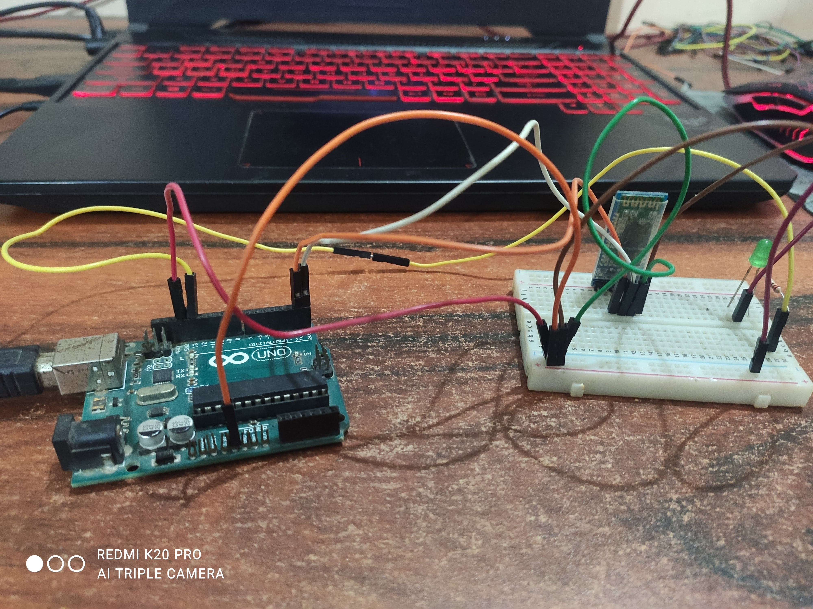

# Control Arduino Lights with a bluetooth module 
A simple project to connect arduino with an android device by using a hc05 bluetooth module, and using an app made by the MIT APP INVENTOR.
The arduino code just starts listening on the 0, 1 and waits for the input, and if the input is 1, turns on the light, and if it's 0, turns off the light, and the bluetooth app, sends that data using bluetooth.

## Circuit

## Android App
