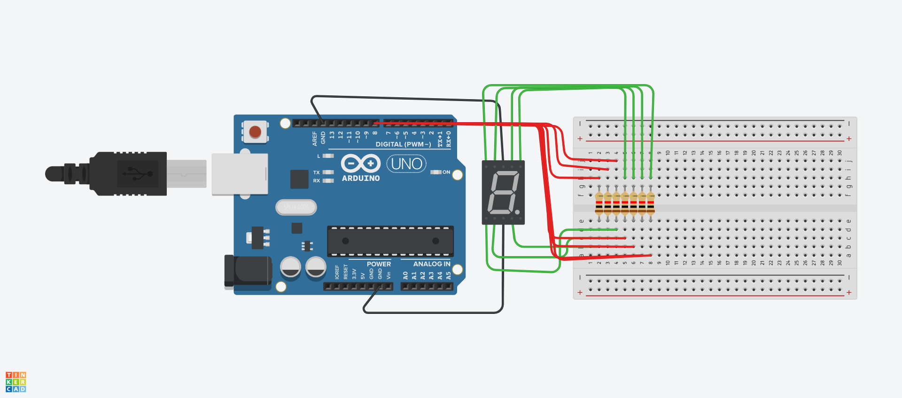

# Controlling Arduino With Python   

This project includes main.py, and code.ino, code.ino. 
 
# Arduino Code
The arduino code consists a LIGHTS array which incldues numbers from 2 to 8, which represent the pin for A to G resepctively.
In the void setup function, we just begin the serial, and set all the pins to output.
Handle commands function takes String command as a parameter, and checks if the legnth is 1, and if it is, just turns all the lights off. If the length isn't one, and if the last letter of the string is H, turns all LIGHTS with pins of the character on. 
# Python Code
In the python code, we first make  a class by the name App, which takes no paramter in the constructor, and makes an object ser, which is the serial.Serial object from the pyserial module (You need to install pyserial using pip install pyserial), which takes the port as a parameter, which would be different for everybody. The next thing it take is the baudrate, which is by default 9600, and a timeout of 1 seconds.
Then, we maintain a dictionary of all the numbers, along with the pins that we would need to turn that particular light on, so for the write_number function, we just encode the string, and send it to arduino, and it gets handled by the handle_commands function, and writes the number.