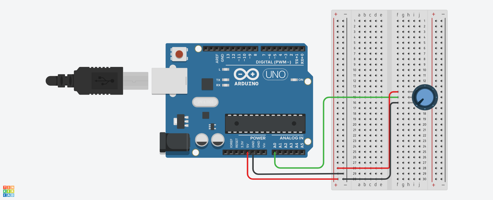

# Data from Arduino to Python
The arduino code is pretty simple, and just Serial prints the reading from the potentiometer and prints it on a bigger baudrate, in Python, it's a simple server, which constantly sends data to the index.html file which constantly updates the graphs and values using javascript
