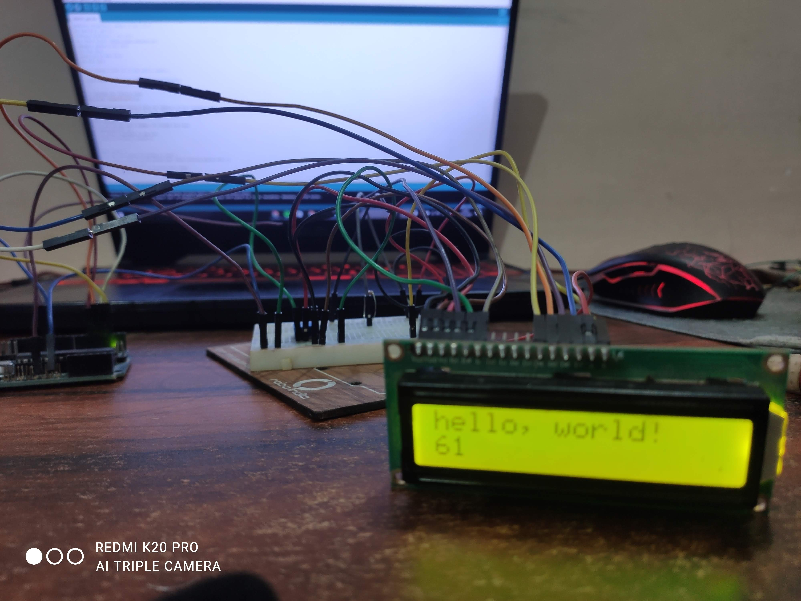

# LCDScreenWithPython
This is a project that allows a user to control the arduino connected to a display using flask server.

# Code 
The project includes 3 main files
<ul>
<li>server.py</li>
<li>code.ino</li>
<li>home.html</li>
</ul>

## server . py
Includes the code for flask server, which can be opened from any device in the same wifi network by using the ip address of your machine, and the port 5000. To find the ip address of your machine, you can just use the ipconfig command in windows, and ifconfig in linux.
It communicates with the arduino using the pyserial module, and for linux, the serial port is /dev/ttyACM0, which would be different for windows.

## code.ino
Includes the arduino sketch for the lcd module. 
Features that arduino code has 
1) Increase the counter, by 1, or decrease by 1 
2) Set the counter to a particular number
3) Changing the text
4) Be able make the text slide

## home.html
Includes the template for home view, uses ajax to send the data to the server.

## Photo:

You can find the demo video <a href="https://drive.google.com/file/d/1wolaw77MIz0rFQMe6TC0hm0wGUTfl2hF/view?usp=sharing">here</a>.