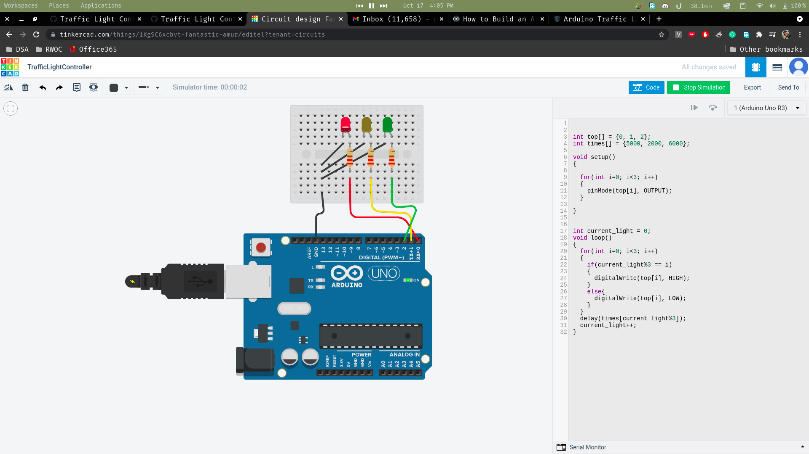

# TRAFFIC LIGHT CONTROLLER
A basic traffic light controller, consits of three leds, on pin numbers 0, 1, 2, with colors, red, yellow, and green respectively.
# Code 
The Code consists of an array named top, which contains all the pin numbers of the leds, in the order I want them to blink.
The next line contains an array named times, which consists the time (in ms) that we want to wait after every light, in the code, I made the red light to be 5 seconds, yellow to be 1 seconds, and green to be 6 seconds. 
In the void setup function, we iterate over the top array, and setup all the pinModes to OUTPUT, and before the loop function, we go make a variable named as current_light, and if we use current_light%3, that would give us the light that we need to turn on, and the rest of the lights need to be turned off, so the for loop does that
# Screenshot 
