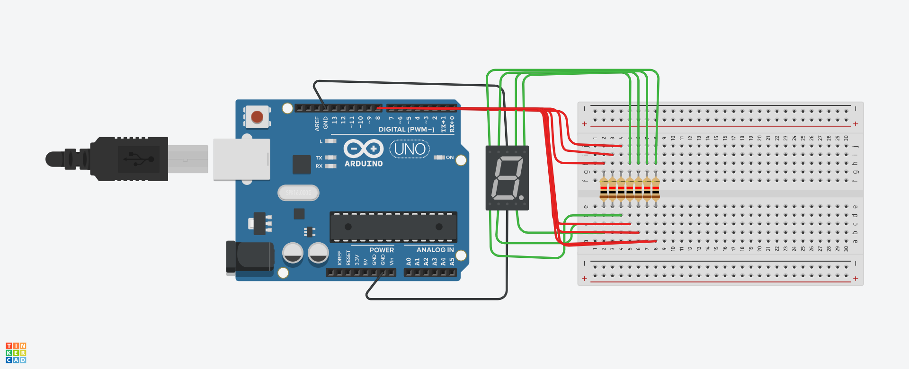

# 7 Segment Display
* A 7-segment display consists of seven LEDs (hence its name) arranged in a rectangular fashion as shown.
* This is a project in which displays numbers 0 to 9 nine on a 7-segment display.

## Code Explanation
* First of all, we neet to set the resistor value at 500 Ω & set 7-segment display as anode.
* In the code, we have made a single function which handles the code for all the numbers so we don't have to make different functions. For a particular number, we make a string, which includes the pin names we need to turn on to make that number, so, we just maintain an array of commands, and an array for pin numbers of all the letters, and we're good to go. 
* At last, we have void loop(void) function to display a number by calling other functions at a time interval of WAITING_TIME second, currently set to 1000ms.

## Screenshot

[You can also check the simulation by clicking here!](https://youtube.com/shorts/IpUcZ4BTOPo?feature=share)
