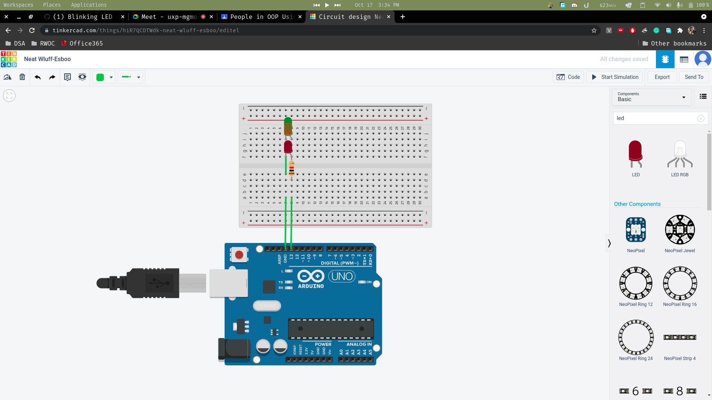

# BLINKING LED
This is a simple project which consists of a simple blinking led, which is connected via the pin number 13.
# Code
The code consists of a simple led on the pin numebr 13, and that pin mode is set to output. The normal code would just consist of a digitalWrite high, and low, with a delay in between, but to make it better, I added the serial communication, where you can send a h or l to increase or decrease the timings between each blink by 500ms.
# Screenshot of circuit
