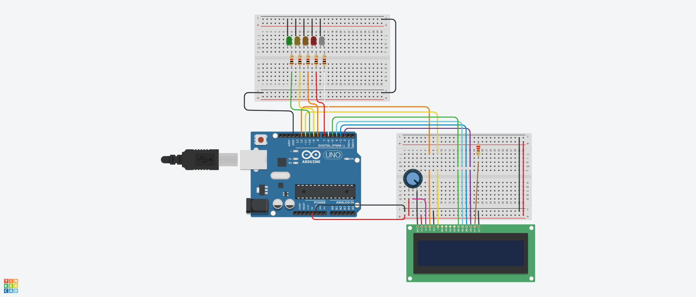

# Multiple LEDs Blinking

The reason this script was a little different than others was because, you cannot use the normal delay, or even multithreading, so you have to give the illusion of multithreading. So, what the script basically does is, maintain three arrays, LIGHTS, which include all the pin numbers of all the LEDs, and then, LIGHTS_ON, a boolean array which contains whether a given light is on or not, and then an array named DELAYS, which  includes time in seconds for every single light.
The script waits for a second, and then checks if any of the lights are supposed to be on or off on that particular second, and if it is, switches the light on or off accordingly. 