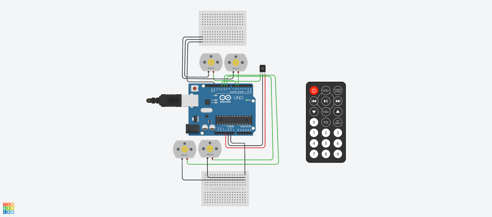

# Controlling motors using IR remote
A very basic script to control motors witht the help of an IR remote and IR sensor

The Power button turns the motor on or off, and the up and down button increase and decrease the speed by about 10% of the maximum RPM.