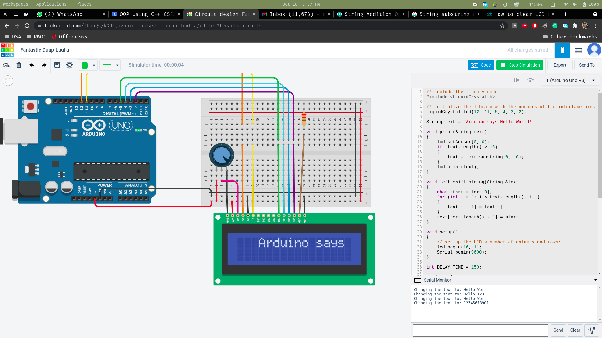

# Sliding text on a LCD
For this particular script, what we did is, take a given a string, and then use an algorthim to shift everything to left, and display that on the lcd, every single time, after 150ms. For example, if the string text="123456" it would change that to "234561", but that wouldn't make the text appear sliding, so, whenever you set the text from the serial monitor, and if the text is less than 16, it would just add whitespaces to the text.

## Screenshot 
