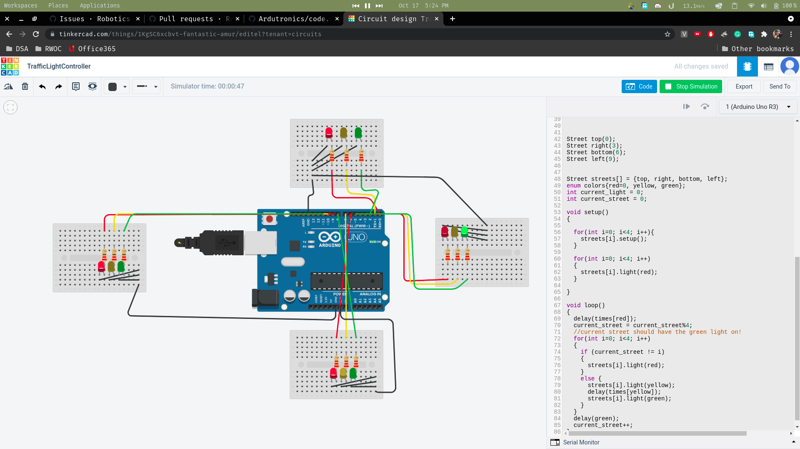

# Traffic controller for four streets
This is a basic traffic controller written for four streets' intersection
# How code works?
First of all, we make a class by the name street, and a street class has an array by the name, lights, which would contain the pin numbers for the red, yellow, and green lights, and then, another function named setup, which goes over all the lights and sets them to be on the OUTPUT mode, and the other function light, which turns the given light on, and turns the other remaining lights off
We make 4 objects, top, right, bottom, and left, and make an array for them so it's easier to maintain by the name of streets, and we make a variable named current_street, to keep track of which street's turn it is. 
In the void setup function, we first of all turn all the lights off, for each of the streets.
In the void loop function, we first of all delay the time for the red light, and then, after that turn the current_street's yellow light on, wait for the given time, and then turn the green light on, while turning the other lights to red.
# Screenshot
